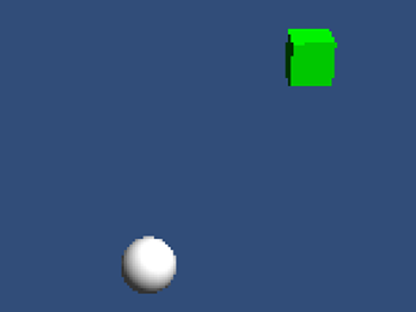

HFT-Unity Device Orientation and Accleration example
====================================================

This is a sample Unity3D game for the [HappyFunTimes party games system](http://greggman.github.io/HappyFunTimes).

For each player a cube appears. They can orient the cube by orienting their phone. Shake the phone
up to move the cube forward.

If you just want to play go to http://superhappyfuntimes.net/game/unitydevorientaccel

Cloning
-------

[If you want to clone this follow the instructions here](https://github.com/greggman/HappyFunTimes/blob/master/docs/unitydocs.md)

